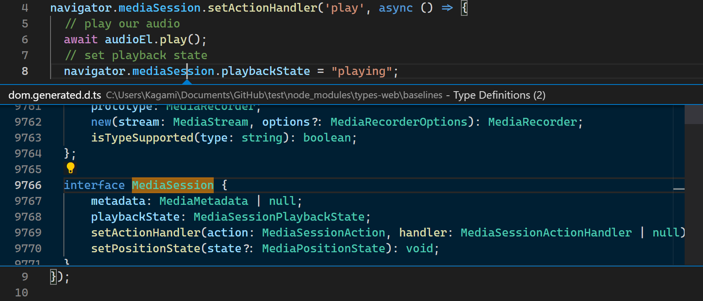

# types-web

Get types for the latest web APIs as soon as they become widely available!



[The default types generator](https://github.com/microsoft/TypeScript-DOM-lib-generator/) for TypeScript requires manual review for every update, and thus does not provide types for every latest API in a timely manner. `types-web` solves this issue by deploying automation by following tools:

  * [`@mdn/browser-compat-data`](https://www.npmjs.com/package/@mdn/browser-compat-data) provides which features are supported by which browsers, so that undersupported features can be disabled automatically.
  * [`webref`](https://github.com/w3c/webref) provides IDL code from the specs, so that the features can be properly typed.

See how many types have been added in the [changelog](CHANGELOG.md).

## How to use

1. Install the package by [`npm i types-web`](https://www.npmjs.com/package/types-web).
2. Include the type files in your `tsconfig.json` or `jsconfig.json`:

    ```json5
    {
      "compilerOptions": {
        // Explicitly exclude "dom" here
        "lib": ["es2020"]
      },
      "includes": [
        // For general scripts: dom*
        // Web workers: webworker*
        // Shared workers: sharedworker*
        // Service workers: serviceworker*
        // Audio worklets: audioworklet*
        "node_modules/types-web/baselines/dom*"
        "*"
      ]
    }
    ```

## Why not `@types`?

To maintain the package by myself without waiting for external reviews.

## Why is my fancy API still not available here?

A feature needs to be supported by more than two major browser engines to be included here, to make sure there is a good consensus among vendors: __Gecko__ (Firefox), __Blink__ (Chrome/Edge), and __WebKit__ (Safari).

If the condition is met but still is not available here, please [file an issue](https://github.com/saschanaz/types-web/issues/new).

## Is it fully automated?

Not yet. A small part of things still needs manual modification, which is done by files in `inputfiles/` directory.

## Build Instructions

* To get things setup:

    ```sh
    npm i
    ```

* To generate the `.d.ts` files

    ```sh
    npm run build && npm run baseline-accept
    ```

* To test:

    ```sh
    npm test
    ```

* For larger changes, create a split terminal with:

  ```sh
  npx tsc --watch
  ```

  Running in the background updating your TypeScript files. Then run:

  ```sh
  node ./lib/build.js && node ./lib/test.js
  ```

  To trigger the build and tests.